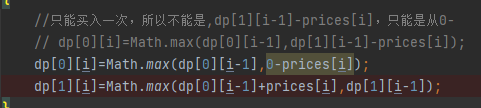
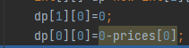

### leetcode 121
最大差值的连续数组
暴力+贪心+动态规划
#### 动态规划
1、dp数组及其下标表示

dp[0][i] 表示第i天持有股票所得最多现金 

dp[1][i] 表示第i天不持有股票所得最多现金

|          | 7  | 1 |5 |6|4|6|
|----------|----|--|---|---|---|---|
| dp[0][i] | -7 | | | | |
| dp[1][i] | 0  | | | | |

2、dp递推公式

3、初始化

4、遍历方式

从前到后

5、取结果
dp[0][n]

